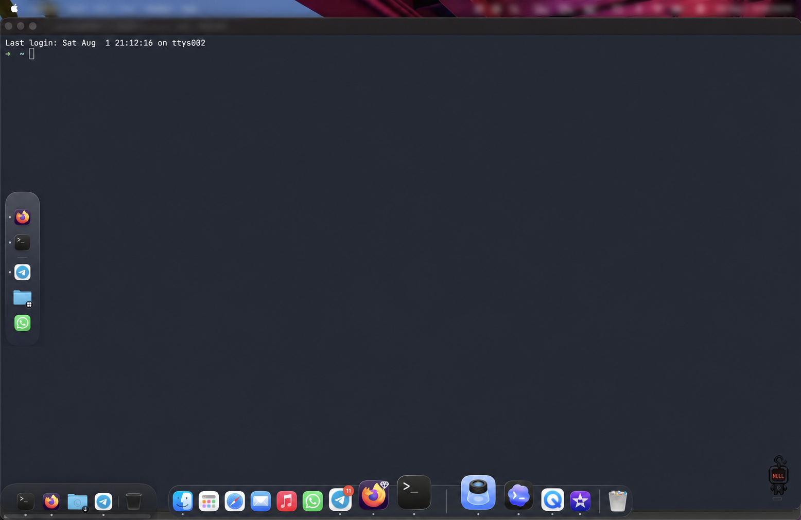
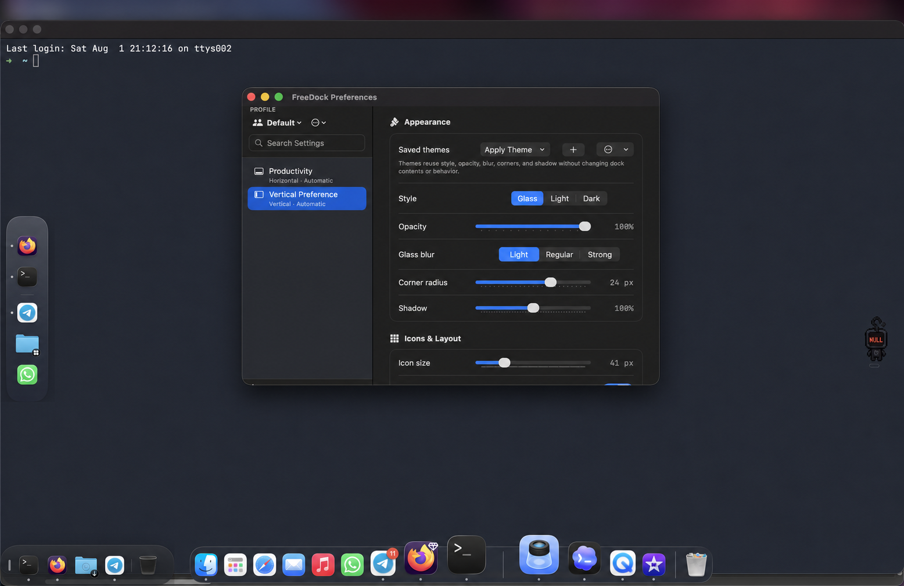
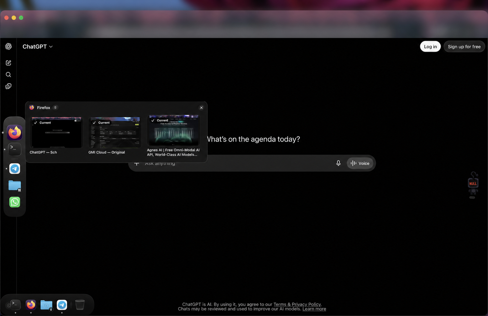

<p align="center">
  
</p>

<h1 align="center">FreeDock</h1>

<p align="center">
  <strong>A flexible, native dock for macOS.</strong>
  <br>
  Create multiple docks, organize them into profiles, and make your workspace fit the way you work.
</p>

<p align="center">
  
  
  
  
</p>

<p align="center">
  
</p>

<p align="center">
  <a href="#build-from-source"><strong>Build FreeDock</strong></a>
  ·
  <a href="docs/ROADMAP.md"><strong>Roadmap</strong></a>
  ·
  <a href="CONTRIBUTING.md"><strong>Contribute</strong></a>
  ·
  <a href="https://www.buymeacoffee.com/thksalot"><strong>Support the project</strong></a>
</p>

FreeDock is a free and open-source alternative for people who want more than one macOS Dock. Keep a compact launcher on each display, separate work and personal apps into profiles, pin files and folders beside applications, or build a focused dock for one project.

It is written in SwiftUI and AppKit, stores its configuration locally, and does not require an account or subscription.

## Preview

### Appearance that adapts per dock

<p align="center">
  
</p>

### Window switching across your workspace

<p align="center">
  
</p>

## Highlights

### Docks that fit your workspace

- Create unlimited horizontal or vertical docks.
- Place docks on any connected display and restore their relative position after reconnecting.
- Resize, magnify, lock, snap, and auto-hide each dock independently.
- Customize blur, opacity, spacing, corners, shadows, indicators, and reusable appearance themes.

### More than an app launcher

- Pin applications, documents, folders, separators, smart stacks, and Trash.
- Reorder items within a dock or drag them between docks; hold Option to copy.
- Browse live folder stacks in grid or list layouts.
- Add dynamic Recent Files and Downloads stacks.
- Drop Finder files onto compatible applications or Trash.

### Profiles and fast navigation

- Keep separate Work, Focus, Personal, or project-specific dock profiles.
- Switch profiles manually, with global shortcuts, when an app becomes active, or when a display connects.
- Use Quick Launch (`⌘⇧Space` by default) to search the nearest dock entirely from the keyboard.
- Export or import a complete configuration or one portable profile.

### Native macOS behavior

- See running indicators and optional recent/running applications.
- Preview and switch between an app’s windows across displays and Desktops.
- Use native context menus for application, document, folder, and Trash actions.
- Honor Reduce Motion, Increased Contrast, VoiceOver, and keyboard navigation.
- Optionally launch FreeDock when you sign in.

### Built for reliability

- Save configuration atomically to `~/.config/freedock.json`.
- Keep three rotating recovery generations and automatically recover from damaged configuration files.
- Undo destructive dock, profile, theme, history, and item actions during the current session.
- Run focused interaction regression tests for hide/reveal, resizing, reordering, Trash, and multi-display recovery.

## Build from source

Requirements:

- macOS 12 or later
- Xcode 16 or later with Swift 6
- Apple Silicon or Intel Mac

```bash
git clone https://github.com/Rubyherp/FreeDock.git
cd FreeDock
make run
```

`make run` builds a proper menu-bar `.app` bundle at `build/FreeDock.app` and opens it. Avoid `swift run` for normal use: it launches the executable without the bundle metadata FreeDock needs for menu-bar agent behavior.

Other useful commands:

```bash
make test              # Run the complete test suite
make test-reliability  # Run high-risk interaction scenarios
make bundle            # Build without opening the app
make release           # Build an optimized, ad-hoc-signed app
```

## macOS security notice

FreeDock’s local builds are ad-hoc signed because the project does not currently use a paid Apple Developer account. macOS may warn that the developer cannot be verified, and Accessibility or Screen Recording permission may need to be granted again after rebuilding the executable.

This does not affect the source code or MIT license, but it is less convenient than a signed and notarized release. Review the source and build it locally if you prefer.

## Getting started

1. Run FreeDock and open its grid icon in the menu bar.
2. Choose **New Dock → Horizontal** or **Vertical**.
3. Drag applications, files, or folders from Finder into the dock.
4. Right-click dock items for additional actions and customization.
5. Open **Preferences** to configure profiles, displays, appearance, shortcuts, automation, backups, and permissions.
6. Use **Lock Dock Positions** after arranging your workspace.

The welcome guide appears on a fresh install and can be reopened from the FreeDock menu.

## Permissions and privacy

FreeDock works as a launcher without optional macOS permissions.

| Permission | Used for | Required? |
| --- | --- | --- |
| Accessibility | Discovering and focusing application windows | Only for window switching |
| Screen Recording | Creating live window thumbnails | No; title and app-icon cards remain available |

Window discovery and focus happen locally. Thumbnails are held only in a small memory cache and are never written to disk. Recent Files records only documents successfully opened through FreeDock, stores at most 50 local paths, and can be cleared at any time.

FreeDock does not include analytics, advertising, online accounts, or feature paywalls.

## Configuration and recovery

Profiles, docks, appearance themes, shortcuts, automation rules, custom item artwork, and local recent history are stored in the human-readable file:

```text
~/.config/freedock.json
```

Before replacing a valid configuration, FreeDock rotates these recovery files:

```text
freedock.json.bak
freedock.json.bak.1
freedock.json.bak.2
```

If the primary file is damaged, FreeDock loads the newest valid recovery generation and repairs the primary file. A previous version can also be restored from **Preferences → Backup & Restore**.

## Project status

FreeDock is actively developed. The core dock, profile, organization, window-switching, appearance, backup, and accessibility features are implemented and covered by automated tests. See the [roadmap](docs/ROADMAP.md) for planned work and areas where contributors can help.

## Contributing

Contributions, bug reports, design feedback, documentation improvements, and focused feature proposals are welcome. Start with [CONTRIBUTING.md](CONTRIBUTING.md), follow the [Code of Conduct](CODE_OF_CONDUCT.md), and use the issue templates when reporting a problem or suggesting a feature.

Please report security vulnerabilities privately using [SECURITY.md](SECURITY.md).

## Support FreeDock

FreeDock is MIT-licensed and every feature remains free. If the project is useful to you, you can support its continued development and the creator’s education.

<p align="center">
  <a href="https://www.buymeacoffee.com/thksalot">
    
  </a>
  <br>
  <a href="https://www.buymeacoffee.com/thksalot"><strong>Buy me a coffee</strong></a>
</p>

## License

FreeDock is available under the [MIT License](LICENSE).
