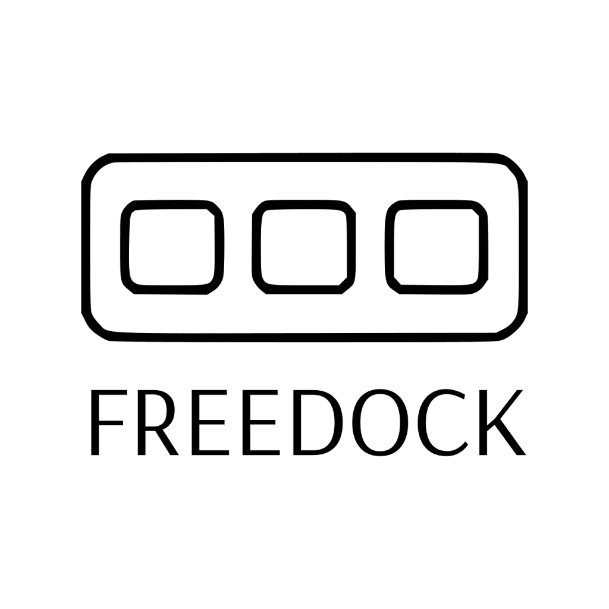
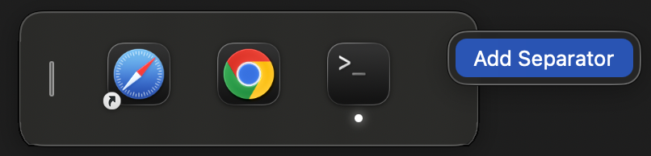
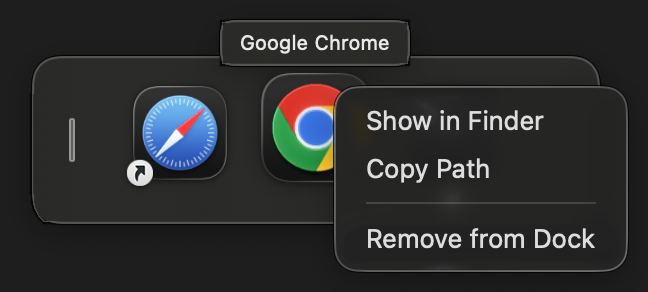
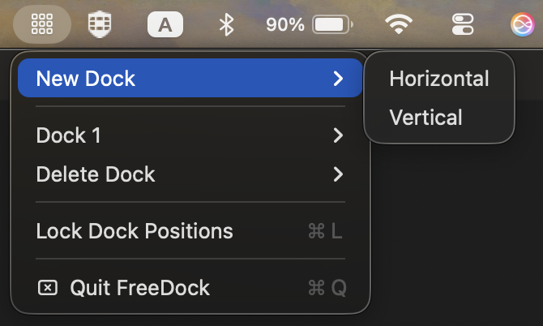
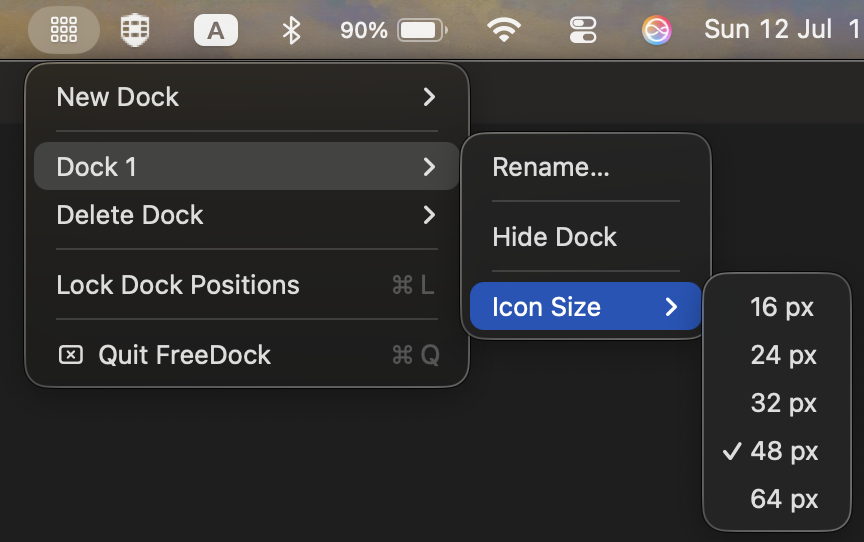

<p align="center">
  
</p>

<h1 align="center">FreeDock</h1>

<p align="center">
  <strong>Multiple floating docks for macOS.</strong>
  <br>
  Free. Open-source. Native.
</p>

<p align="center">
  
  
  
  
</p>

<p align="center">
  
</p>

FreeDock lets you create unlimited floating docks on any macOS screen. Pin your most-used apps, files, and folders, organize them by project, and keep them accessible with a single click — all without touching the system Dock.

---

<p align="center">
  <a href="https://github.com/Rubyherp/FreeDock/stargazers">
    
    
  </a>
  &nbsp;&nbsp;
  <a href="https://www.buymeacoffee.com/thksalot">
    
  </a>
</p>

<p align="center">
  <a href="https://www.buymeacoffee.com/thksalot">
    
  </a>
  <br>
  <strong>If FreeDock saves you time, consider supporting my education.</strong> ☕
</p>

---

## Features

- **Unlimited docks** — Create as many docks as you need, on any screen
- **Dock profiles** — Switch between separate Work, Focus, or Personal dock setups
- **Per-display placement** — Assign each dock to a monitor and restore its relative position after reconnecting
- **Quick Launch** — Press `⌘⇧Space`, type to search the nearest dock, choose with arrows or Tab, and press Return to open
- **Global shortcuts** — Show or hide the active profile with `⌃⌥Space`, or switch profiles with `⌃⌥1…9`
- **Launch at login** — Optionally start FreeDock automatically when you sign in on macOS 13 or later
- **Live per-dock preferences** — Tune opacity, blur, shadows, magnification, spacing, orientation, indicators, and auto-hide
- **Accessible motion** — Honors macOS Reduce Motion across dock, stack, reorder, and preview transitions, with VoiceOver descriptions for movement and resizing controls
- **macOS Dock import** — Append pinned apps to any FreeDock dock without changing Apple’s Dock
- **Apps, files, and folders** — Pin applications, documents, and folders directly from Finder
- **Folder stacks** — Browse live folder contents in an automatic, grid, or list view; sort by name, modification date, or kind, and optionally show hidden files
- **Smart stacks** — Add Recent Files and Downloads without pinning fixed paths; Recent Files tracks successful document opens through FreeDock, while Downloads resolves for the current user
- **Reorder** — Drag apps, documents, folders, and separators into any arrangement
- **Cross-dock organization** — Drag an item to another dock to move it, or hold Option while dropping to copy it
- **Horizontal or vertical** — Choose the orientation that fits your workflow
- **Running app indicators** — See which apps are currently open at a glance
- **Native window switching** — Preview a running app’s windows by title and choose one to bring it forward
- **Native item controls** — Right-click to show, hide, or quit apps; choose how stacks are displayed and sorted; or open a document with another compatible app
- **Open files with apps** — Drop compatible Finder files or folders directly onto a pinned application
- **Open in one click** — Launch apps, open documents, or browse folder stacks
- **Lock positions** — Prevent accidental dock movement
- **Edge auto-hide** — Dock to the nearest screen edge and let it slide away until needed
- **Persistent config** — All docks are saved to `~/.config/freedock.json`
- **Portable backups** — Export or restore every profile and dock from a human-readable JSON file
- **Native & lightweight** — Built with SwiftUI and AppKit, minimal resource usage

## Free and open source, permanently

FreeDock is MIT-licensed and all features are available to everyone. The goal is a thoughtful, native alternative to the system Dock—not a free trial or a feature-gated shell. See the [project roadmap](docs/ROADMAP.md) for the next improvements and ways to contribute.

## Screenshots

<p align="center">
  
  &nbsp;&nbsp;&nbsp;
  
</p>

<p align="center">
  
</p>


## Installation

Download the latest `FreeDock.app` from the [Releases](https://github.com/Rubyherp/FreeDock/releases) page (when available), then drag it to your Applications folder.

### Build from source

```bash
git clone https://github.com/Rubyherp/FreeDock.git
cd FreeDock
make run
```

> **Note:** `swift run` launches the binary directly, bypassing the `.app` bundle. The `LSUIElement` setting (menu-bar agent mode) won't be respected this way. Always use `make run`, `./scripts/build.sh`, or open the `.app` bundle.

> **Development permissions:** Local builds are ad-hoc signed, so macOS may ask you to grant Accessibility or Screen Recording again after the executable changes. Properly signed release builds keep a stable permission identity.

**Requirements:** macOS 12+, Xcode 15+

## Usage

1. Click the **grid icon** (⫷) in your menu bar
2. Select **New Dock → Horizontal** or **Vertical**
3. Drag applications, documents, or folders from Finder into the dock
4. Click an app or document to open it, or click a folder to browse its live contents
5. Add a **Recent Files** or **Downloads** smart stack from the dock’s context menu or Preferences
6. Right-click a stack to choose automatic, grid, or list view; change sorting; or show hidden files
7. Drag pinned items to reorder or move them between docks; hold Option while dropping to copy instead
8. Open **Preferences → Permissions** (or right-click a running app and choose **Enable Window Switching…**) to request Accessibility access from macOS
9. From the same Permissions section, optionally enable Screen Recording for live window thumbnails; macOS may require FreeDock to be reopened after approval
10. Hover over the app or choose **Show Windows…** to see its windows across desktops, then select one to bring it forward
11. Right-click an app to bring it forward, hide it, or quit it; right-click a document to choose **Open With**
12. Drop compatible Finder files onto a pinned app to open them with that app, or use **Open Files with…** from its right-click menu
13. Press `⌘⇧Space` from any app to search the nearest dock without reaching for the pointer

**Pro tip:** Use **Lock Dock Positions** from the menu bar to prevent accidental moves.

**Recent Files privacy:** This stack records only documents that FreeDock successfully opens. It does not read the system-wide recent-items list. Up to 50 paths are stored locally in `~/.config/freedock.json`, and you can clear the history from the stack or its right-click menu.

**Window switching privacy:** Discovery and focus happen locally using macOS Accessibility and WindowServer APIs. Optional window thumbnails require Screen Recording access, are kept in a small memory-only cache, and are never written to disk. Without that permission, the same cards remain available with app icons and window titles. A thumbnail shows each window’s currently selected tab; inactive tabs are not separate macOS windows and cannot be captured generically without switching them. Like every FreeDock feature, window switching remains free and open source.

**Window switcher keyboard controls:** Right-click a running app and choose **Show Windows…**, then use the arrow keys, Tab, or Shift-Tab to move between cards. Press Return, keypad Enter, or Space to activate the selected window, or Escape to close the switcher.

**Customization:** Choose **Preferences…** from the FreeDock menu to manage window permissions, switch or manage profiles, create and organize docks, add files, folders, or smart stacks, assign docks to displays, import pinned apps from the macOS Dock, adjust behavior and appearance, or copy and reset dock settings. Changes are applied and saved immediately.

**Shortcuts:** Press `⌘⇧Space` for Quick Launch. Type to narrow the pinned items in the dock nearest your pointer, use the arrow keys or Tab and Shift-Tab to move the selection, press Return to open it, or Escape to close. Press `⌃⌥Space` to show or hide every dock in the active profile. The first nine profiles are available globally with `⌃⌥1` through `⌃⌥9`.

## Configuration

Docks, profiles, and FreeDock’s local recent-document history are saved to `~/.config/freedock.json`. The file is human-readable and editable — changes take effect the next time FreeDock launches. Format version 4 adds Recent Files and Downloads smart stacks plus a bounded `recentFiles` history. Version 3 introduced typed application, document, folder, and separator items. Older application-only and top-level dock configurations migrate automatically.

```json
{
  "formatVersion": 4,
  "activeProfileID": "11111111-1111-1111-1111-111111111111",
  "recentFiles": [
    {
      "path": "/Users/example/Documents/Project Brief.pdf",
      "displayName": "Project Brief.pdf",
      "lastOpenedAt": 806976000
    }
  ],
  "profiles": [
    {
      "id": "11111111-1111-1111-1111-111111111111",
      "name": "Work",
      "docks": [
        {
          "id": "22222222-2222-2222-2222-222222222222",
          "name": "Main",
          "position": [100, 100],
          "displayPlacement": {
            "displayID": "33333333-3333-3333-3333-333333333333",
            "displayName": "Built-in Retina Display",
            "normalizedCenter": [0.5, 0.1],
            "edge": "bottom"
          },
          "orientation": "horizontal",
          "iconSize": 48,
          "magnificationEnabled": true,
          "magnification": 1.3,
          "itemSpacing": 3,
          "appearance": "glass",
          "surfaceOpacity": 1,
          "blurStyle": "regular",
          "shadowStrength": 1,
          "cornerRadius": 18,
          "showRunningIndicators": true,
          "autoHideWhenDocked": true,
          "autoHideDelay": 1,
          "items": [
            {
              "id": "44444444-4444-4444-4444-444444444444",
              "kind": "application",
              "path": "/Applications/Safari.app",
              "appPath": "/Applications/Safari.app",
              "label": "Safari",
              "isSeparator": false
            },
            {
              "id": "55555555-5555-5555-5555-555555555555",
              "kind": "document",
              "path": "/Users/example/Documents/Project Brief.pdf",
              "appPath": "/Users/example/Documents/Project Brief.pdf",
              "label": "Project Brief.pdf",
              "isSeparator": false
            },
            {
              "id": "66666666-6666-6666-6666-666666666666",
              "kind": "folder",
              "path": "/Users/example/Downloads",
              "appPath": "/Users/example/Downloads",
              "label": "Downloads",
              "folderOptions": {
                "presentation": "automatic",
                "sortOrder": "dateModified",
                "showHiddenFiles": false
              },
              "isSeparator": false
            },
            {
              "id": "77777777-7777-7777-7777-777777777777",
              "kind": "folder",
              "path": "",
              "appPath": "",
              "label": "Recent Files",
              "smartStackSource": "recentFiles",
              "folderOptions": {
                "presentation": "list",
                "sortOrder": "recentlyOpened",
                "showHiddenFiles": false
              },
              "isSeparator": false
            },
            {
              "id": "88888888-8888-8888-8888-888888888888",
              "kind": "folder",
              "path": "",
              "appPath": "",
              "label": "Downloads",
              "smartStackSource": "downloads",
              "folderOptions": {
                "presentation": "automatic",
                "sortOrder": "dateModified",
                "showHiddenFiles": false
              },
              "isSeparator": false
            },
            {
              "id": "99999999-9999-9999-9999-999999999999",
              "kind": "separator",
              "path": "",
              "appPath": "",
              "isSeparator": true
            }
          ]
        }
      ]
    }
  ]
}
```

FreeDock also writes the active profile’s docks to a top-level compatibility field so older builds can still open the current setup. Typed items retain the legacy `appPath` and `isSeparator` fields for the same reason; `kind` and `path` are the version 3 fields to use when editing the file.

Smart stacks are folder-style items with an empty path and a `smartStackSource`. A Downloads stack resolves the current user’s Downloads directory dynamically instead of saving it as a fixed path. Only one stack for each smart source can be added to a dock.

## Contributing

Contributions are welcome! Please read `CONTRIBUTING.md` before opening a PR.

## Security

To report a vulnerability, please follow `SECURITY.md` and avoid public issue disclosure.

## Code of Conduct

Please read `CODE_OF_CONDUCT.md` before participating.

## License

MIT
